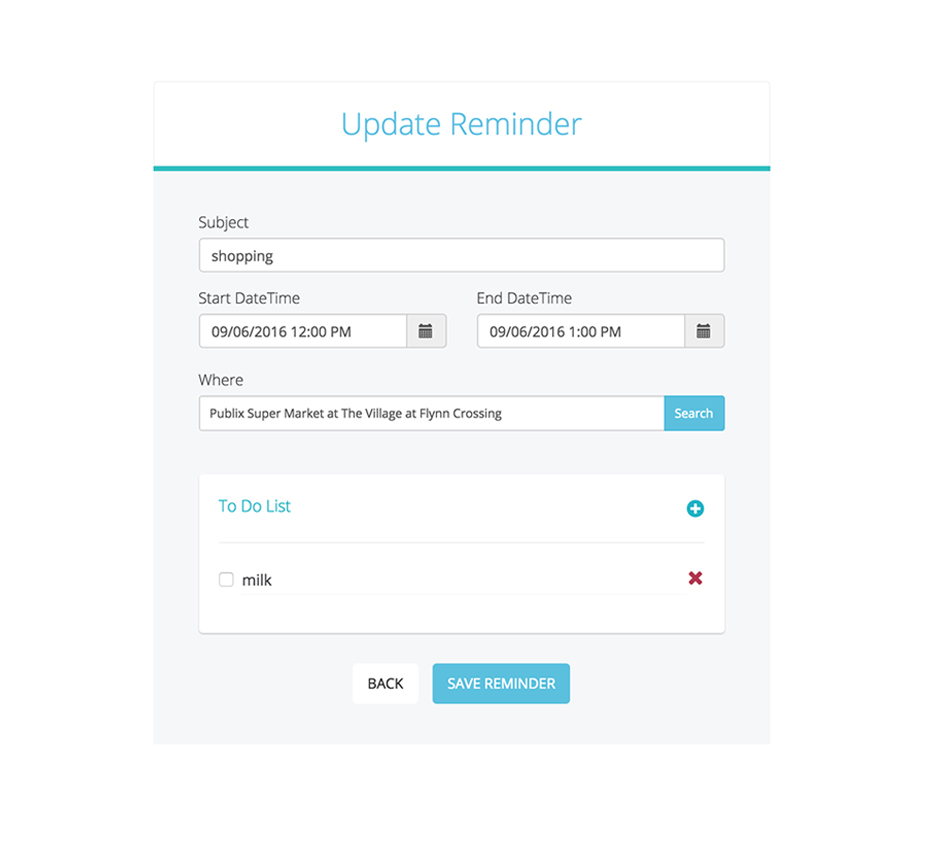

<!DOCTYPE html>
<html>
<head>
	<title>Documentation</title>

	<link href="https://maxcdn.bootstrapcdn.com/bootstrap/3.3.7/css/bootstrap.min.css" rel="stylesheet" integrity="sha384-BVYiiSIFeK1dGmJRAkycuHAHRg32OmUcww7on3RYdg4Va+PmSTsz/K68vbdEjh4u" crossorigin="anonymous">
	<link rel="stylesheet" href="css/main.css">
</head>

<body>

	

		

			<h3>Weekly Reminder</h3>
			

			
Thinkful (<a href="http://www.thinkful.com">http://www.thinkful.com</a>) end of course Capstone project - a responsive weekly reminder application that offers Google users account to create a reminder by setting a calendar event combined with a location and to do list of each one.

		

		

			

				
			

			

				
			

			

				
			

			

				
			

		

		<section class="intro">
			<h3>Introduction</h3>
			

			

				Weekly Reminder Applicaiton is designed for Google users account to use the access of combination of Google Calendar, Google Places, and Google Task in order to create the event reminder. The application will show a current week starting from Sunday to Saturday. The current date will set of a default and will show all the events of that day. Users will be able to click at any days of the current week to see if there is any events set.
			

			

				In order to create the event, the application provides a function that will link to the "add event page". This page, user will be able to set the event, time and chose the lists of places from search box which results are based on current location. Moreover, user will be able to add tasks as many as possible in each events and mark each task when the task is complete or delete it.
			

			

				In case that users would like to update the event, this app also have a function that users can edit and update as well.
			

			
		</section>

		<section class="design">
			<h3>UX Design</h3>
			

			

				The Wireframs is design along with the work-flow. This app is also designed to work on mobile as well as desktop from the outlet.
			

			

				

					
				

			

		</section>

		<section class="site">
			<h3>Live Site</h3>
			

			
You can access Password Vault at <a href="https://thitaphat29.github.io/Weekly-Reminder/">https://thitaphat29.github.io/Weekly-Reminder/</a>

		</section>

		<section class="tech">
			<h3>Technical</h3>
			

			<ul>
				<li>The front-end is built using HTML5, CSS3 and JavaSrcipt</li>
				<li>The app is fully responsive, adapting for mobile and desktop viewports.</li>
				<li>Using OAuth 2.0 to access google APIs and request an access token from the Google Authentication Server.</li>
				<li>Google handles user authentication and consent, and the result is an access token. Google returns the access token on the fragment of the response, and client side script extracts the access token from the response.</li>
				<li>Use Google Calendar API JavaScript Web App Library to display, create, and modify calendar events.</li>
				<li>Use Google Places API Web Services to query for place information based on user's current location. A Place API returns a list of places along with summary information about each place.</li>
				<li>Use Google Tasks API JavaScript Web App Library to display, create, and modify tasklist and tasks</li>
				<li>Built a logic to engage calendar events and tasklist for user convenience</li>
			</ul>
		</section>

	

</body>
</html>